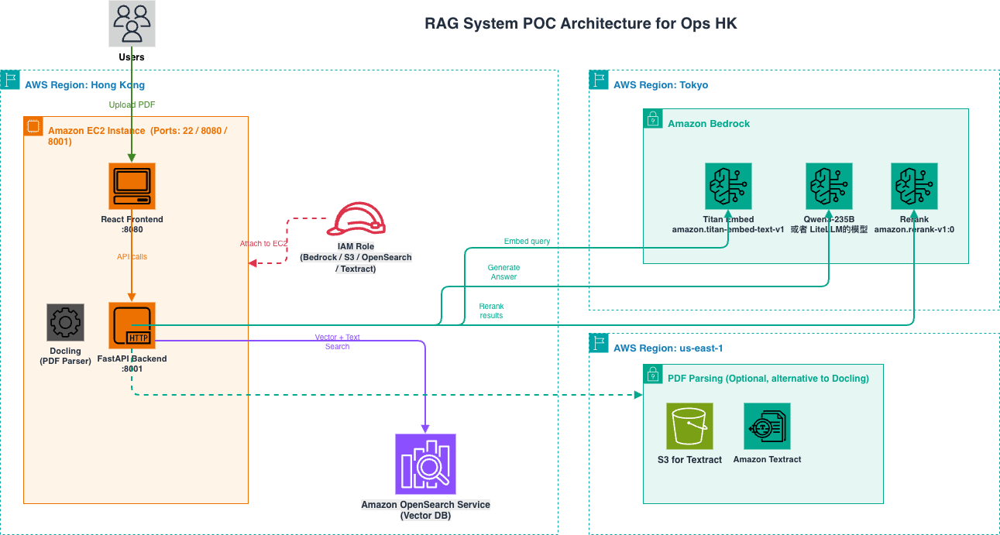

# RAG 系统 AWS 进行POC部署指南

本文档介绍如何将此 RAG 系统部署到 AWS 上进行POC。生产环境的部署需要调整。

## 目录

- [架构总览](#架构总览)
- [前置条件](#前置条件)
- [第一步：创建 OpenSearch 集群（ap-east-1）](#第一步创建-opensearch-集群ap-east-1)
- [第二步：创建 IAM 角色](#第二步创建-iam-角色)
- [第三步：EC2 实例要求（ap-east-1）](#第三步ec2-实例要求ap-east-1)
- [第四步：部署后端（FastAPI）](#第四步部署后端fastapi)
- [第五步：部署前端（React）](#第五步部署前端react)
- [第六步：验证部署](#第六步验证部署)
- [可选：使用 AWS Textract](#可选使用-aws-textract)
- [费用估算（参考）](#费用估算参考)

---

## 架构总览



**为什么跨区域？**
- EC2 和 OpenSearch 放在 **ap-east-1（香港）**
- Bedrock 全部模型（Embedding、LLM、Rerank）统一放在 **ap-northeast-1（东京）**
- Textract（可选）使用 **us-east-1（弗吉尼亚）**，香港和东京都没有

---

## 前置条件

1. 一个 AWS 账户
2. 一台 ap-east-1 区域的 EC2 实例（详见第三步）
3. 项目代码已就绪

---

## 第一步：创建 OpenSearch 集群（ap-east-1）

### 1.1 集群配置要求

| 配置项 | 值 | 说明 |
|--------|-----|------|
| 区域 | ap-east-1（香港） | 与 EC2 同区域 |
| Engine version | OpenSearch 2.x 最新版 | 需要支持 kNN |
| Instance type | r6g.large.search | 8GB 内存， POC |
| Instance count | 1 | 单节点 |
| EBS volume | gp3, **100 GB** | 存储向量索引 |
| Availability Zone | 1-AZ | POC 环境 |

### 1.2 网络配置（VPC 私有访问）

| 配置项 | 值 | 说明 |
|--------|-----|------|
| Network | **VPC access** | 不使用公网访问 |
| VPC | 与 EC2 同一 VPC | 确保网络互通 |
| Subnet | 与 EC2 同一子网（或同 VPC 内可达子网） | |
| Security group | 新建专用安全组 | 入站规则：仅允许 EC2 安全组访问 443 端口（HTTPS） |

### 1.3 访问控制配置

| 配置项 | 值 | 说明 |
|--------|-----|------|
| Fine-grained access control | **启用** | |
| Internal user database | **启用** | 使用内置用户数据库 |
| Master user | 创建用户名和密码 | 例如 `admin` / `YourStrongPassword123!` |


### 1.4 记录端点

创建完成后（约 15-20 分钟），在 Domain 详情页找到 **Domain endpoint**，类似：

```
search-project-name-abcdefxxxxx.ap-east-1.es.amazonaws.com
```

### 1.6 后端 API 如何连接 OpenSearch

后端通过 `config.py` 配置 OpenSearch 连接信息，使用 HTTPS + 用户名密码认证：

```python
# config.py
OPENSEARCH_HOST = "search-project-name-abcdefxxxxx.ap-east-1.es.amazonaws.com"
OPENSEARCH_USERNAME = "admin"
OPENSEARCH_PASSWORD = "YourStrongPassword123!"
```


连接建立后，系统会自动执行以下操作：
- **上传 PDF 时**：自动创建 index（如果不存在），使用 HNSW kNN 向量索引，bulk API 批量写入文档向量
- **问答查询时**：在 index 上执行 kNN 向量搜索或 BM25 文本搜索


---

## 第二步：创建 IAM 角色

EC2 实例需要一个 IAM 角色来访问 Bedrock、OpenSearch 等 AWS 服务，这样就不需要在服务器上配置 Access Key。

EC2 的 IAM 角色需要以下权限：

| 权限 | 用途 |
|------|------|
| `bedrock:InvokeModel` | 调用 Embedding 和 LLM 模型 |
| `bedrock:Rerank` | 调用 Rerank 模型 |
| `es:ESHttp*` | 访问 OpenSearch 域（读写索引） |
| `s3:GetObject`, `s3:PutObject` | 读写 S3 中的 PDF 文件（可选，仅在使用 S3 存储时需要） |
| `textract:StartDocumentAnalysis`, `textract:GetDocumentAnalysis` | 调用 Textract API（可选，仅在使用 Textract 时需要） |


---

## 第三步：EC2 实例要求（ap-east-1）

| 项目 | 要求 |
|------|------|
| 实例类型 | **m7i.large**（2 vCPU, 8GB RAM） |
| 存储 | 50 GB gp3 |
| 区域 | ap-east-1（香港） |
| VPC | 与 OpenSearch 同一 VPC |
| IAM 角色 | 绑定第二步创建的角色 |

**安全组入站规则：**

| Port | Source | 用途 |
|------|--------|------|
| 22 | 运维 IP | SSH 登录 |
| 8080 | 用户访问 IP 段 | React 前端 |

> 后端 8001 端口仅供前端在同一台机器上调用，无需对外开放。

---

## 第四步：部署后端

以下操作在 EC2 实例上执行。

### 4.1 拷贝代码到 EC2

将项目代码拷贝到 EC2 上

### 4.2 创建 Python 虚拟环境并安装依赖

```bash
cd huatai-rag/api
python3 -m venv .venv
source .venv/bin/activate

# 安装依赖
pip install --upgrade pip
pip install -r requirements.txt
```

### 4.3 配置 config.py

```bash
cp config.py.example config.py
nano config.py
```

修改以下内容：

```python
# OpenSearch 配置 — 填入第一步创建的端点和凭证
OPENSEARCH_HOST = "search-huatai-rag-hyladc3m7noebefee5dgneqfsy.ap-east-1.es.amazonaws.com"
OPENSEARCH_USERNAME = "admin"
OPENSEARCH_PASSWORD = "YourStrongPassword123!"
OPENSEARCH_INDEX = "huatai_rag"

# 模型配置 — 所有 Bedrock 模型统一使用东京区域
LLM_MODEL_NAME = "qwen.qwen3-235b-a22b-2507-v1:0"
EMBEDDING_MODEL_NAME = "amazon.titan-embed-text-v2:0"
REGION_NAME = "ap-northeast-1"

# Rerank 配置 — 同样使用东京区域
RERANK_MODEL_NAME = "amazon.rerank-v1:0"
RERANK_REGION_NAME = "ap-northeast-1"

# 其余配置保持默认即可
```


### 4.4 验证后端

```bash
source .venv/bin/activate
python api.py
```

在另一个终端测试：
```bash
curl http://localhost:8001/health
# 应返回：{"status":"healthy"}
```

确认正常后 `Ctrl+C` 停止。

---

## 第五步：部署前端

### 5.1 安装依赖

```bash
cd huatai-rag/frontend
npm install
```

### 5.2 配置 API 地址

创建生产环境配置文件：

```bash
echo "VITE_API_BASE_URL=http://<EC2公网IP>:8001" > .env.production
```

### 5.3 构建前端

```bash
npm run build
```

构建完成后，静态文件在 `dist/` 目录下。

### 5.4 验证前端

```bash
npx serve -s dist -l 8080
```

浏览器访问 `http://<EC2公网IP>:8080`，应该能看到 RAG 系统界面。


### 5.5 后台运行

使用 `nohup` 将后端和前端作为后台进程运行：

```bash
# 后端
cd /home/ubuntu/huatai-rag/api
source .venv/bin/activate
nohup python api.py > api.log 2>&1 &

# 前端
cd /home/ubuntu/huatai-rag/frontend
nohup npx serve -s dist -l 8080 > frontend.log 2>&1 &
```


---

## 第六步：验证部署

### 6.1 上传 PDF 测试

1. 浏览器访问 `http://<EC2公网IP>:8080`
2. 进入上传页面，选择一个 PDF 文件上传
3. 等待处理完成
4. 处理完成后，文件出现在已处理列表中

### 6.2 问答测试

1. 进入问答页面
2. 选择刚上传的文档
3. 输入问题进行测试
4. 确认能正常返回答案和源文档

---

## 可选：使用 AWS Textract（需要实现，目前代码没有这个功能）

如果希望使用 AWS 托管服务进行 PDF 解析，可以使用 Amazon Textract（部署在 us-east-1，功能支持最完整）。

### 实施步骤

#### 1. 确保 IAM 角色有 Textract 权限

在 EC2 的 IAM 角色中添加 `textract:StartDocumentAnalysis` 和 `textract:GetDocumentAnalysis` 权限。

#### 2. 创建 S3 桶（Textract 多页 PDF 需要 S3）

Textract 的异步 API 要求 PDF 文件在 S3 上，S3 桶需要在 **us-east-1** 区域创建（与 Textract 同区域）。

#### 3. 更新代码和配置 config.py

```python
# 文档解析器选择：docling 或 textract
DOCUMENT_PARSER = "textract"  # 或 "docling"

# Textract 配置（仅 DOCUMENT_PARSER="textract" 时需要）
TEXTRACT_REGION_NAME = "us-east-1"
TEXTRACT_S3_BUCKET = "huatai-rag-textract-docs"
```

---
