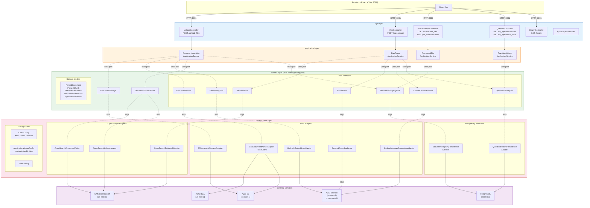
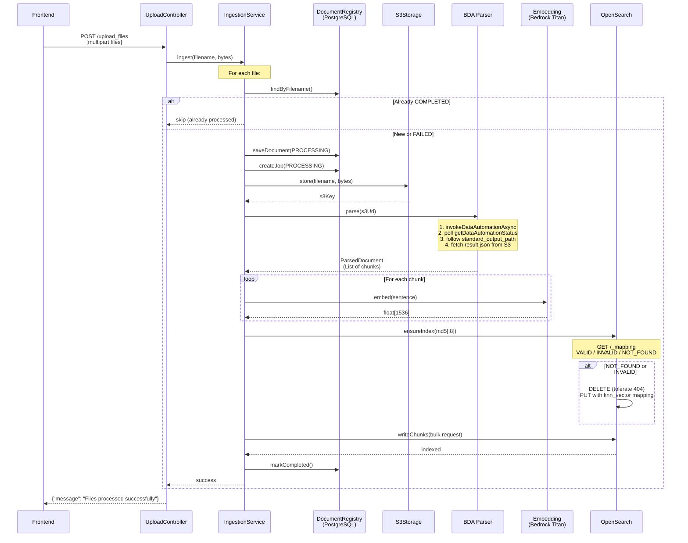
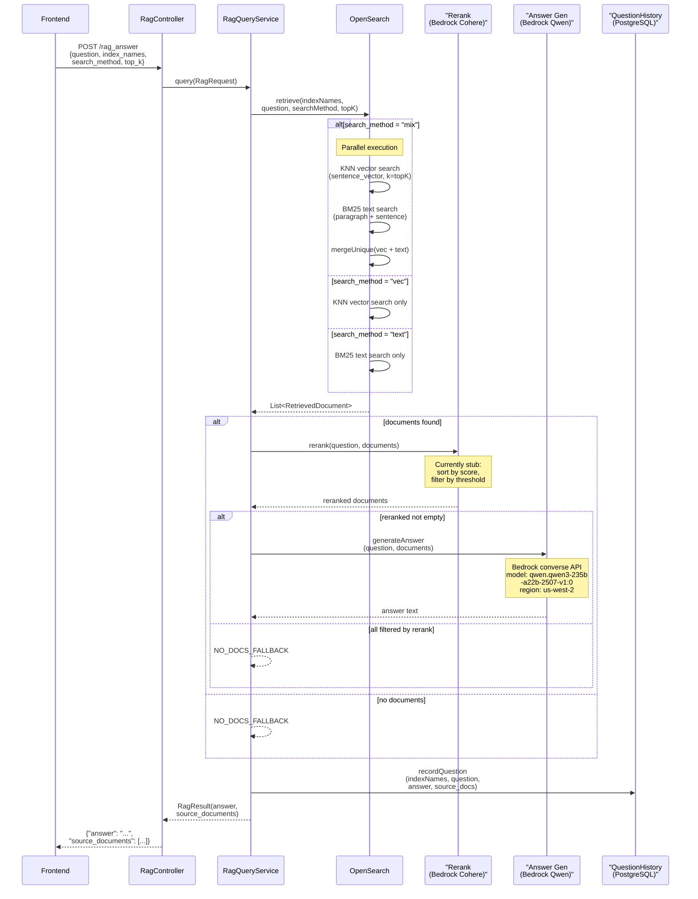
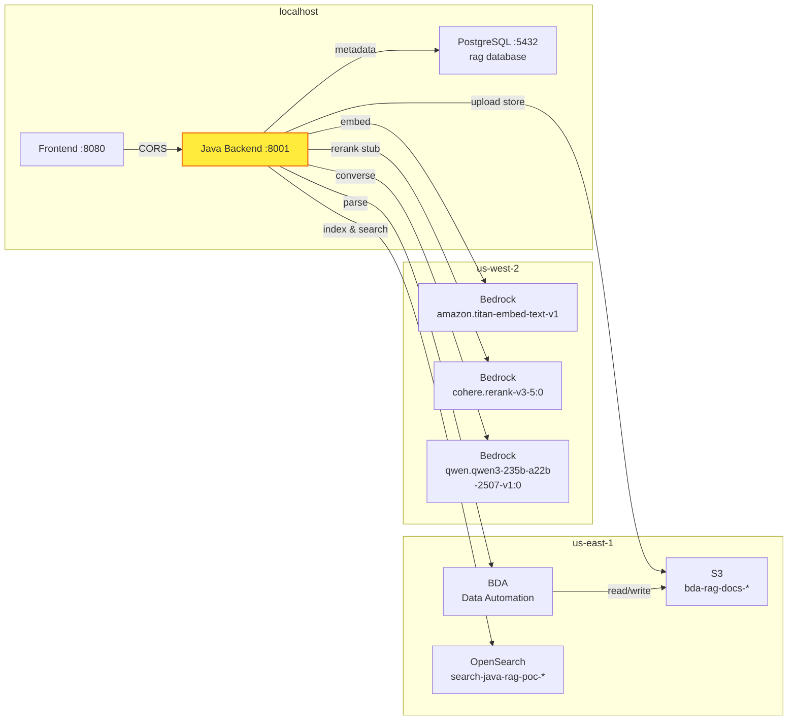

# Java Backend Architecture Diagrams

## 1. Layered Architecture & Port/Adapter Isolation



### Port 替换成本矩阵

```
                        +-----------------------+
                        |     domain layer      |
                        |  (pure Java, 0 deps)  |
                        +-----------+-----------+
                                    |
              port interfaces       |        can swap independently
         +----------+----------+---+---+----------+----------+
         |          |          |       |          |          |
    +----v---+ +---v----+ +--v---+ +-v------+ +-v------+ +-v---------+
    |Embedding| |Rerank  | |Answer| |Retrieval| |Parser  | |Storage    |
    |Port     | |Port    | |Gen   | |Port     | |        | |           |
    +----+----+ +---+----+ +--+---+ +----+----+ +---+----+ +-----+-----+
         |          |         |          |           |            |
    current impl    |         |          |           |            |
    +----v----+ +---v----+ +--v------+ +-v--------+ +--v-------+ +--v----+
    |Bedrock  | |Bedrock | |Bedrock  | |OpenSearch| |BDA       | |S3     |
    |Titan    | |Cohere  | |Qwen     | |          | |          | |       |
    +---------+ +--------+ +---------+ +----------+ +----------+ +-------+
         |          |         |          |           |            |
    possible swap   |         |          |           |            |
    +----v----+ +---v----+ +--v------+ +-v--------+ +--v-------+ +--v----+
    |OpenAI   | |Cohere  | |OpenAI   | |Milvus   | |Tika      | |MinIO  |
    |Embedding| |Direct  | |GPT-4    | |Qdrant   | |Unstruct. | |Local  |
    |Azure    | |Jina    | |Azure    | |Elastic  | |LlamaParse| |Azure  |
    +---------+ +--------+ +---------+ +----------+ +----------+ +-------+
```

***

## 2. Upload & Ingestion Flow



***

## 3. RAG Query Flow



***

## 4. AWS Service Dependency Map



